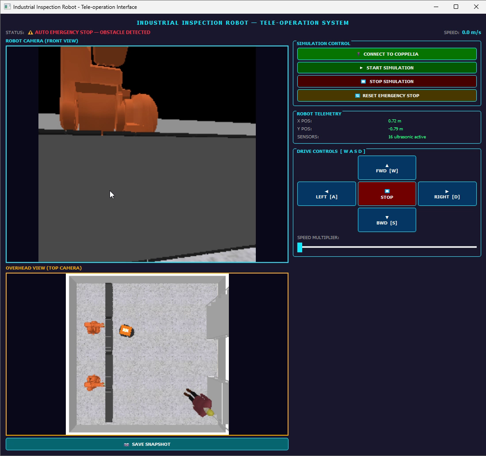
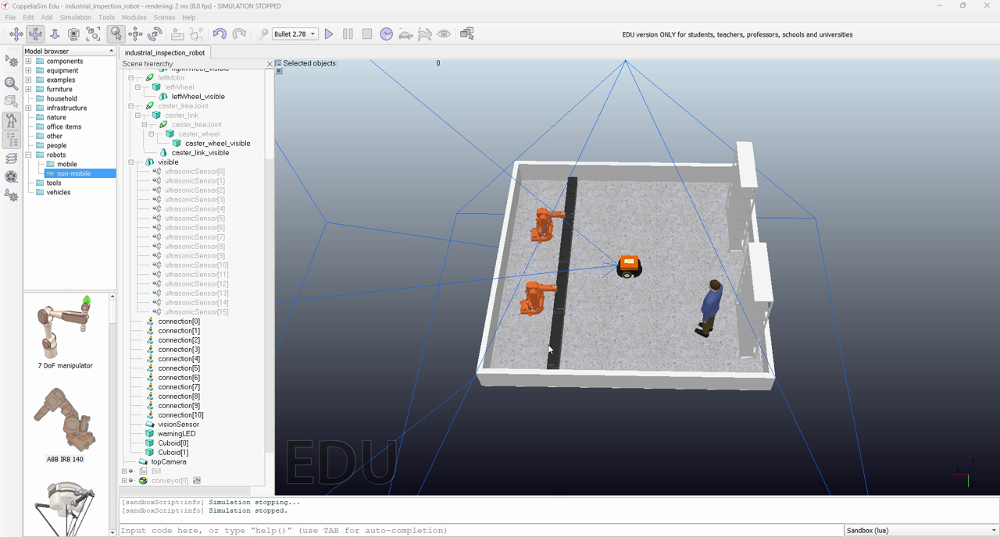

# Industrial Inspection Robot — Tele-operation System

A tele-operated mobile inspection robot in a simulated factory cell, built in **CoppeliaSim** with a **PyQt5** operator interface. The operator drives a Pioneer P3-DX around a workspace shared with conveyors, two ABB IRB 140 arms, and a human worker, using live camera feeds. The robot stops itself automatically when it gets too close to an obstacle.



▶ **[Watch the demo video](cw1-teleoperation/media/demo.mp4)** (6.5 min walkthrough of the scene, GUI, driving, auto e-stop and snapshot capture)

## Features

- **Two live camera feeds**: the robot's front-facing vision sensor and an overhead camera covering the whole cell
- **Drive controls**: hold **W A S D** on the keyboard or the on-screen arrow buttons, with a 1×–3× speed multiplier
- **Automatic emergency stop**: the Pioneer's 16 ultrasonic sensors halt the robot when an obstacle is too close. The stopping threshold scales with the selected speed. The GUI shows the stop, and the operator resets it from the GUI.
- **Telemetry**: live X/Y position and commanded speed
- **Inspection snapshots**: save the current front-camera frame to `snapshot.png`
- **Simulation control**: connect, start and stop the simulation from the GUI

## Scene



The scene (`cw1-teleoperation/scene/industrial_inspection_robot.ttt`) contains:
- Pioneer P3-DX with a front vision sensor, 16 ultrasonic sensors, and a warning LED
- A walled factory cell with conveyors, a storage rack, and two ABB IRB 140 manipulators
- A human worker model ("Bill") for testing safety behaviour
- `/topCamera`, a top-level overhead vision sensor

## How it works

```
┌──────────────────────┐   ZeroMQ Remote API    ┌─────────────────────────────────┐
│  robot_teleop.py     │ ─────────────────────▶ │  CoppeliaSim                    │
│  (PyQt5 GUI)         │  driveRobot(v, ω, k)   │  /PioneerP3DX child script (Lua)│
│                      │  resetEmergency()      │   • differential-drive motors   │
│  100 ms drive loop   │  getEmergencyState()   │   • ultrasonic e-stop logic     │
│  300 ms camera loop  │ ◀───────────────────── │   • warning LED                 │
│                      │  getVisionSensorImg()  │  /PioneerP3DX/visionSensor      │
│                      │  getObjectPosition()   │  /topCamera                     │
└──────────────────────┘                        └─────────────────────────────────┘
```

- The GUI resolves the held keys or buttons into a forward speed and a turn rate every 100 ms. It then calls the Lua function `driveRobot` on the robot's child script, which converts them into left and right wheel velocities.
- Every 300 ms the GUI polls `getEmergencyState`, pulls both camera images, flips them vertically (CoppeliaSim images are bottom-up), and draws them.
- The emergency-stop logic runs in the Lua child script inside the scene, so the robot stops even if the GUI lags.

## Getting started

**Requirements:** CoppeliaSim 4.6 or newer (Edu is fine) and Python 3.8+

```bash
pip install -r requirements.txt
```

1. Open `cw1-teleoperation/scene/industrial_inspection_robot.ttt` in CoppeliaSim. The ZeroMQ Remote API server starts automatically with CoppeliaSim.
2. Run the GUI:
   ```bash
   python cw1-teleoperation/robot_teleop.py
   ```
3. Click **Connect to Coppelia**, then **Start Simulation**.
4. Click the GUI window so it has keyboard focus, then drive with **W A S D**.
5. If the robot auto-stops, back away from the obstacle and click **Reset Emergency Stop**.

## Repository layout

```
├── cw1-teleoperation/
│   ├── robot_teleop.py                     # PyQt5 tele-operation GUI
│   ├── scene/
│   │   └── industrial_inspection_robot.ttt # CoppeliaSim scene (includes the robot's Lua child script)
│   └── media/                              # Screenshots and demo video
└── requirements.txt
```

## Context

Built for a mobile robotics coursework module in the BEng programme (University of Hertfordshire, delivered at PSB Academy, Singapore). The brief was to design and assess a tele-operated application for a mobile robot, covering mechanical design, control and motion planning, sensing, human–robot interaction, and safety.

## Author

**Steve Flinston** ([@steveerobotclubsmt-create](https://github.com/steveerobotclubsmt-create))
