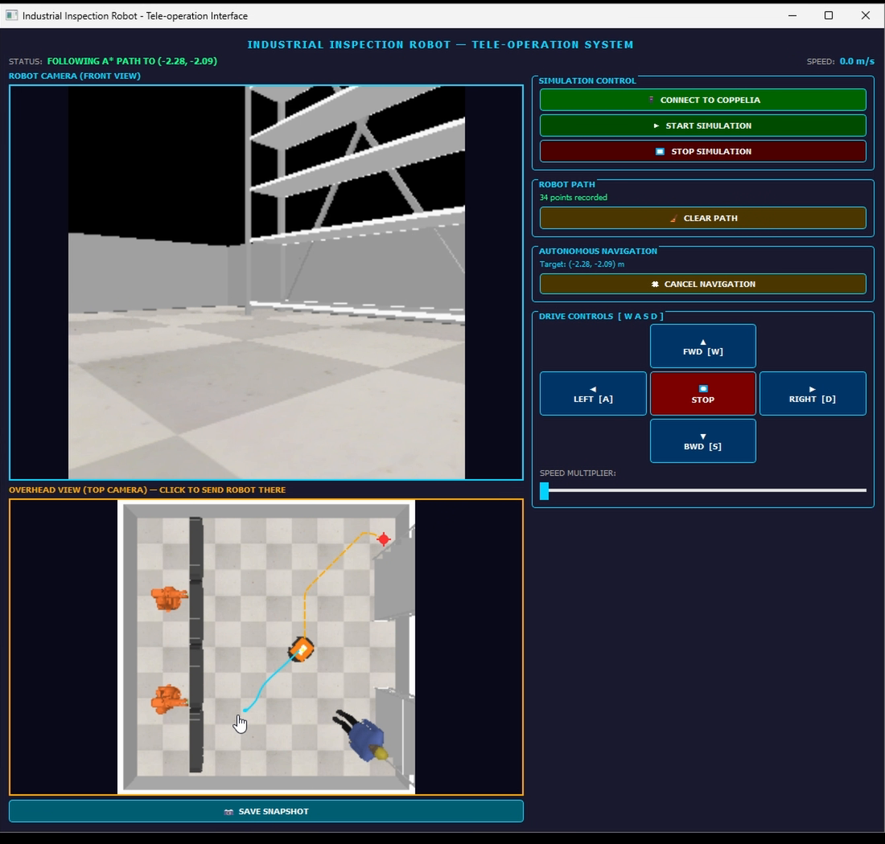

# Mobile Robot Industrial Inspection — Pioneer P3-DX in CoppeliaSim

A mobile inspection robot working in a simulated factory cell, built in **CoppeliaSim** with a **PyQt5** operator interface. The project was developed over two courseworks:

| | Coursework | What it adds |
|---|---|---|
| **CW1** | [Tele-operation application](#cw1--tele-operation) | Remote driving with live cameras, telemetry, and an ultrasonic auto emergency stop |
| **CW2** | [Autonomous navigation](#cw2--autonomous-navigation) | Click-to-go navigation: occupancy grid from the overhead camera, A* path planning, waypoint following, and a 4-phase obstacle recovery |

Both use the same workspace: a walled cell with conveyors, two ABB IRB 140 arms, storage racks, and a human worker.



---

## CW1 — Tele-operation

The operator drives the robot remotely using a front camera and an overhead camera.

▶ **[Demo video](cw1-teleoperation/media/demo.mp4)** (6.5 min)


**Features**
- **Two live camera feeds**: the robot's front vision sensor and an overhead camera covering the whole cell
- **Drive controls**: hold **W A S D** or the on-screen arrow buttons, with a 1×–3× speed multiplier
- **Automatic emergency stop**: the 16-sensor ultrasonic ring halts the robot near obstacles, with a threshold that scales with speed. The operator resets it from the GUI.
- **Telemetry**: live X/Y position and commanded speed
- **Inspection snapshots**: save the current front-camera frame to `snapshot.png`

**Architecture**

```
┌──────────────────────┐   ZeroMQ Remote API    ┌─────────────────────────────────┐
│  robot_teleop.py     │ ─────────────────────▶ │  CoppeliaSim                    │
│  (PyQt5 GUI)         │  driveRobot(v, ω, k)   │  /PioneerP3DX child script (Lua)│
│                      │  resetEmergency()      │   • differential-drive motors   │
│  100 ms drive loop   │  getEmergencyState()   │   • ultrasonic e-stop logic     │
│  300 ms camera loop  │ ◀───────────────────── │   • warning LED                 │
│                      │  getVisionSensorImg()  │  /PioneerP3DX/visionSensor      │
│                      │  getObjectPosition()   │  /topCamera                     │
└──────────────────────┘                        └─────────────────────────────────┘
```

The emergency stop runs in the Lua child script inside the scene, so the robot stops even if the GUI lags.

---

## CW2 — Autonomous navigation

CW2 keeps the tele-operation interface and adds autonomous navigation. **Click anywhere on the overhead camera view** and the robot plans a route there and drives it by itself. Pressing any manual control cancels the autonomous run straight away, so the operator always has override.

▶ **[Demo video](cw2-navigation/media/demo.mp4)** (5 min)

### How it works

```
click on overhead view
        │
        ▼
 pixel → world coords ──▶ occupancy grid from overhead camera ──▶ A* search ──▶ waypoints
                          (grayscale → blur → threshold →          (8-connected,     │
                           dilate by robot radius)                   Euclidean h)     ▼
                                                                         waypoint follower (100 ms)
                                                                         heading + distance P-control
                                                                                   │
                                     sonar ring ──▶ collision check / jam detection ┤
                                                                                   ▼
                                               recovery: reverse → pivot → escape → brake & re-plan
```

**1. Vision-based mapping.** No map is prepared in advance. When you click a target, the latest overhead frame is converted to grayscale and Gaussian-blurred, which stops the checkerboard floor from being read as obstacles. It is then thresholded into floor and obstacle, and the obstacles are dilated by roughly the robot's radius so that planned paths keep clear of edges.

**2. A\* path planning.** An 8-connected grid search (diagonal moves cost √2) with a Euclidean heuristic. The pixel path is sampled every 5th cell and converted into world-frame waypoints. If the target is unreachable, the GUI reports it.

**3. Waypoint following.** A proportional heading/distance controller runs every 100 ms. The robot turns in place when its heading error is large and slows as it gets close. Waypoints are dropped once the robot is within 0.15 m, which smooths out the staircase shape of the grid path. The goal tolerance is 10–20 cm.

**4. Obstacle detection and recovery.** Sonar readings are checked against different distance thresholds for the front, the front diagonals, and the sides. This lets the robot pass through narrow aisles without false triggers. A jam detector catches the case where the robot isn't moving even though no sensor has triggered. Either one starts a 4-phase recovery:
1. **Reverse** in a straight line, stopping early if the rear sonars see something
2. **Pivot** 45° toward whichever side has more open space, based on the sonar readings summed across each half of the ring
3. **Escape drive** forward if the front is clear, otherwise backward
4. **Brake and re-plan** from the new position to the original goal

**5. Reverse safety override.** Every reverse command, whether from the operator or from recovery, is cancelled if the rear sonars read under 15 cm.

**GUI additions:** the planned path (orange dashed), the driven path (cyan), a target marker, a path-point counter, Clear Path, and Cancel Navigation.

### Limitations
- **Localisation** uses CoppeliaSim's ground-truth pose. A real robot would need wheel odometry plus correction, for example Monte Carlo Localisation.
- **Mapping** is rebuilt from scratch on every plan and only covers what the overhead camera can see. Nothing is stored between plans, and there's no SLAM.
- **Grid paths** are made of 45° segments. The waypoint follower smooths them out, but they are not the shortest possible path in continuous space.
- **The jam detector counts turning in place as being stuck.** If a target needs a turn of more than about 90°, the robot spins for over 0.8 s without changing position, and that sets off the reverse → pivot → escape recovery even when the path is clear. The robot still reaches the target, just with an unnecessary manoeuvre. Counting a tick as stuck only when the robot was told to drive forward or backward would fix it.

---

## Getting started

**Requirements:** CoppeliaSim 4.6 or newer (Edu is fine) and Python 3.8+

```bash
pip install -r requirements.txt
```

| | Scene to open in CoppeliaSim | Then run |
|---|---|---|
| CW1 | `cw1-teleoperation/scene/industrial_inspection_robot.ttt` | `python cw1-teleoperation/robot_teleop.py` |
| CW2 | `cw2-navigation/scene/industrial_inspection_robot_nav.ttt` | `python cw2-navigation/robot_navigation.py` |

1. Open the scene. CoppeliaSim starts the ZeroMQ Remote API server automatically.
2. Run the script, then click **Connect to Coppelia** and **Start Simulation**.
3. Drive with **W A S D** (click the window first so it has keyboard focus). In CW2, you can also click a point on the overhead view to send the robot there.

> Each scene has its own Lua child script on `/PioneerP3DX`, which the matching Python script calls. Use each script with its own scene.

## Repository layout

```
├── cw1-teleoperation/
│   ├── robot_teleop.py                       # PyQt5 tele-operation GUI
│   ├── scene/industrial_inspection_robot.ttt # Scene + Lua child script (e-stop)
│   └── media/                                # Screenshots and demo video
├── cw2-navigation/
│   ├── robot_navigation.py                   # GUI + vision A* planner + waypoint follower + recovery
│   ├── scene/industrial_inspection_robot_nav.ttt
│   └── media/
└── requirements.txt
```

## Context

Built for the Mobile Robots and Drones module of the BEng programme (University of Hertfordshire, delivered at PSB Academy, Singapore). CW1 asked for the design and assessment of a tele-operated mobile robot application. CW2 asked for the design and simulation of a navigation system for the same robot.

## Author

**Steve Flinston** ([@steveerobotclubsmt-create](https://github.com/steveerobotclubsmt-create))
